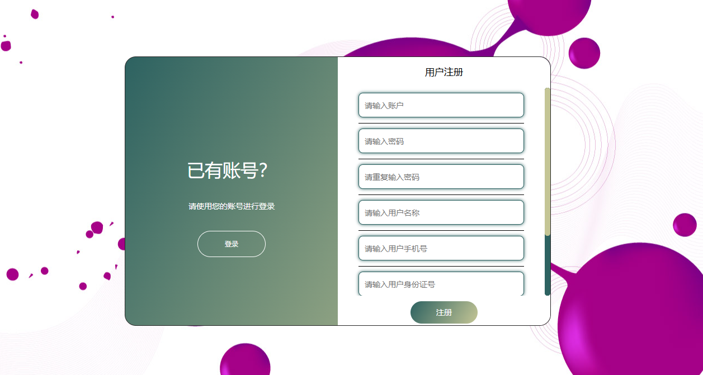

# 一、系统说明

基于springboot+vue+elementui开发的健康医院门诊在线挂号系统,系统功能齐全, 代码简洁易懂，适合小白学编程。

# 二、系统架构

######      前端：vue| elementui

######      后端：springboot | mybatis 

######      环境：jdk1.8+ | mysql8.0+ | maven

# 三、代码及数据库

# 四、相关功能介绍

#### 1).客户端

###### 1.登录

###### 2.注册

###### 3.首页

###### 4论坛

###### 5.药品详情

包含:购买、加入购物车功能

###### 6.公告信息

###### 7.药品列表

###### 8.医生列表

###### 9.医生详情

包含:立即挂号、医生咨询功能

###### 10.个人中心->医生挂号

###### 11.个人中心

###### 12.个人中心->收货地址

###### 13.个人中心->药品收藏

###### 14.个人中心->药品评价

###### 15.个人中心->药品订单

###### 16.个人中心->医生收藏

###### 17.个人中心->医生评价

###### 18.个人中心->医生留言

###### 19.个人中心->挂号

###### 20.购物车

#### 2).管理端

###### 1.登录

###### 2.个人中心->修改密码

###### 3.管理员管理

包含:删除、修改、新增、详情功能

###### 4.用户管理

包含:删除、修改、新增、详情、重置密码功能

###### 5.医生管理

包含:删除、修改、新增、详情、重置密码功能

###### 6.医生管理->医生评价管理

包含:删除、详情、回复功能

###### 7.医生管理->医生留言管理

包含:删除、详情、回复功能

###### 8.医生管理->医生收藏管理

包含:详情、删除功能

###### 9.挂号管理

包含:详情、删除功能

###### 10.药品管理

包含:修改、详情、删除、新增、下架功能

###### 11.药品管理->药品评价管理

包含:删除、详情、回复功能

###### 12.药品管理->药品收藏管理

包含:删除、详情功能

###### 13.药品管理->药品订单管理

包含:删除、详情、报表功能

###### 14.基础数据管理

包含:公告类型管理、药品类型管理、科室管理、职位管理

###### 15.论坛管理

包含:修改、详情、删除、查看论坛回复功能

###### 16.公告信息管理

包含:修改、详情、删除、新增功能

###### 17.轮播图管理

包含:修改、详情、删除、新增功能

